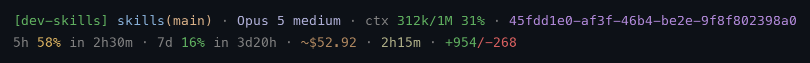

# skills

A collection of custom [Claude Code](https://claude.ai/code) skills, packaged as the `dev-skills` plugin — one install delivers 24 skills, 4 sub-agents, and the `/loop` orchestrator command.

> [!CAUTION]
> **Read every skill before you install it. Nothing here is guaranteed.**
>
> These skills are instructions that steer an agent with real tool access — they run commands, edit files, create branches and commits, and open PRs on your behalf. A skill that reads fine can still do the wrong thing in your repo.
>
> Before installing, open the `SKILL.md` files (and `.agents/*.md`, `hooks/hooks.json`, `statusline/*.sh`) and check what they actually do. Note that the plugin's `SessionStart` hook writes a `statusLine` entry into your `~/.claude/settings.json` — see [Status Line](#status-line) for exactly what it touches and how to opt out.

## Installing the Plugin

Requires the [Claude Code CLI](https://claude.ai/code).

1. Add this repo as a marketplace:

   ```text
   /plugin marketplace add amjadjibon/skills
   ```

2. Install the plugin:

   ```text
   /plugin install dev-skills@amjadjibon-skills
   ```

3. Verify it's installed — skills and command with `claude plugin list`, agents with `/agents`:

   ```sh
   claude plugin list
   ```

4. Invoke any skill with the `dev-skills:` namespace:

   ```text
   /dev-skills:dev-create-plan add rate limiting to the API
   /dev-skills:dev-loop add rate limiting to the API
   ```

**Try before installing** — load it for one session with no marketplace/install step, from a local clone:

```sh
claude --plugin-dir /path/to/skills
```

**Update or remove:**

```text
/plugin update dev-skills
/plugin uninstall dev-skills
```

If a skill doesn't show up after install, run `/reload-plugins` (or restart the session) and re-check with `claude plugin list`.

## Skills

| Skill | Description |
| ----- | ----------- |
| [dev-research](skills/dev/dev-research/SKILL.md) | Research a codebase, approach, or technology before planning — compare candidates, verify claims with spikes and web/doc lookups, write `docs/<feature>/RESEARCH.md` with a recommendation. Also spawned as a scoped sub-agent by the plan/implement skills for single questions (third-party APIs, libraries, docs). |
| [dev-design](skills/dev/dev-design/SKILL.md) | Decide a feature's shape before planning — system design, data model, API/interface contract, UI/UX, whichever axes apply. Writes `docs/<feature>/DESIGN.md` that `dev-create-plan` builds phases from. |
| [dev-api-design](skills/dev/dev-api-design/SKILL.md) | REST and GraphQL API design principles — resource/URL design, pagination, versioning, GraphQL schema-first design, DataLoader/N+1 prevention, Relay pagination. Hands off to `openapi-spec` for the actual spec document. |
| [dev-ui-design](skills/dev/dev-ui-design/SKILL.md) | Build a clickable UI prototype as one self-contained HTML file (inline CSS, no build step) to demo a screen or flow before real frontend code is written. Writes `docs/<feature>/prototype.html`. |
| [dev-create-plan](skills/dev/dev-create-plan/SKILL.md) | Create a structured `docs/<feature>/PLAN.md` with phases, tasks, and verifiable completion criteria. Branches, commits the plan, and integrates git at phase boundaries. |
| [dev-implement-plan](skills/dev/dev-implement-plan/SKILL.md) | Execute a `PLAN.md` produced by `dev-create-plan` — tick checkboxes as tasks complete, commit each phase, handle deviations, and open a PR on completion. |
| [dev-e2e-testing](skills/dev/dev-e2e-testing/SKILL.md) | Write and maintain end-to-end tests (`tests/e2e/`) — what earns an E2E test, Playwright/Cypress setup, fixture independence, and treating flake as a bug, not weather. |
| [dev-smoke-testing](skills/dev/dev-smoke-testing/SKILL.md) | Write fast, thin, one-check-per-file sanity scripts (`scripts/test-<check-name>.sh\|py`) — is it alive right now, run on demand instead of manually testing by hand. Not a CI/CD pipeline gate; safe against production. |
| [dev-tdd](skills/dev/dev-tdd/SKILL.md) | The red → green TDD loop — what a good test is, seams, anti-patterns, and the rules of the cycle. Used by `dev-implement-plan` for test-first phases; `dev-qa` backfills coverage on existing code instead. |
| [dev-code-review](skills/dev/dev-code-review/SKILL.md) | Review a diff or branch for correctness, security, and simplification; writes findings to `docs/<feature>/REVIEW.md` with severity ratings. |
| [dev-loop](skills/dev/dev-loop/SKILL.md) | Autonomous orchestrator — runs `dev-create-plan → dev-implement-plan → dev-code-review → fix → re-review` until clean, then pauses for approval before pushing. |
| [dev-refactor](skills/dev/dev-refactor/SKILL.md) | Refactor code without changing behavior — extract functions, reduce duplication, simplify logic, improve naming. Verifies tests pass before and after each step. |
| [dev-debug](skills/dev/dev-debug/SKILL.md) | Systematically debug a failing test, error, or unexpected behavior — reproduce, isolate root cause, fix minimally, verify, add a regression test. |
| [dev-perf](skills/dev/dev-perf/SKILL.md) | Profile, optimize, and benchmark — measure baseline first, find the real bottleneck, optimize one thing at a time, confirm improvement with numbers. |
| [dev-review-plan](skills/dev/dev-review-plan/SKILL.md) | Review a PLAN.md before implementation — catch vague tasks, missing completion criteria, risky assumptions, and scope issues. Writes findings to `docs/<feature>/PLAN-REVIEW.md`. |
| [dev-qa](skills/dev/dev-qa/SKILL.md) | Quality assurance — measure test coverage, identify untested paths, write missing unit/integration/e2e tests, produce a QA report with before/after coverage numbers. |
| [dev-clean-up](skills/dev/dev-clean-up/SKILL.md) | Housekeeping — remove merged local and remote branches, prune stale tracking refs, close resolved GitHub issues, clean up leftover worktrees. |
| [dev-release](skills/dev/dev-release/SKILL.md) | Cut a release — derive the version bump from conventional commits, generate a changelog, bump version files, tag, and publish a GitHub release. |
| [brainstorming](skills/misc/brainstorming/SKILL.md) | Continuous interactive ideation partner — spreads ideas across safe/middle/bold, defaults to critical engagement over agreement, no hand-off or convergence point. |
| [git-safe](skills/misc/git-safe/SKILL.md) | Pre-flight gate for destructive git commands (force push, reset --hard, clean -f, branch -D, rebase/amend on pushed branches) and the canonical commit hygiene/message conventions the other skills reference. |
| [openapi-spec](skills/misc/openapi-spec/SKILL.md) | Write and validate OpenAPI 3.1 spec documents — `$ref`-based reusable components, Spectral/Redocly lint rules. No code generation; assumes `dev-api-design` already decided the shape. |
| [mermaid-diagram](skills/misc/mermaid-diagram/SKILL.md) | Generate Mermaid diagrams (flowchart, sequence, architecture, deployment, class, state, ER) from a description or source code, with high-contrast styling and `mmdc` validation before handoff. |
| [github-actions](skills/misc/github-actions/SKILL.md) | Create and review GitHub Actions workflows — CI, release/publish, reusable workflows, composite actions, matrix builds, caching, and security hardening. Validates with `actionlint`. |
| [prototype](skills/misc/prototype/SKILL.md) | Build a throwaway prototype in the real codebase to answer one design question — a driveable TUI for a state/logic question, or several structurally different UI variants on a real route switchable via `?variant=`. Adapted from [mattpocock/skills](https://github.com/mattpocock/skills/tree/main/skills/engineering/prototype). |

## Agents

The plugin also ships four sub-agent definitions under `.agents/`, used by the skills when they spawn parallel workers (skills fall back to general-purpose agents when installed standalone without the plugin):

| Agent | Spawned by | Role |
| ----- | ---------- | ---- |
| [dev-researcher](.agents/dev-researcher.md) | dev-create-plan, dev-implement-plan, dev-loop, dev-research (ultra) | Answers one scoped research question (API contract, library, docs, web) into `docs/<feature>/research/<topic>.md`. Read-only + web tools. |
| [dev-implementer](.agents/dev-implementer.md) | dev-implement-plan (ultra), dev-loop | Implements one PLAN.md phase in an isolated worktree from its Agent Prompt block. Commits; never pushes. |
| [dev-fixer](.agents/dev-fixer.md) | dev-loop | Fixes a group of REVIEW.md findings in an isolated worktree, in parallel with other fixers. |
| [dev-tester](.agents/dev-tester.md) | dev-qa (ultra), dev-loop | Writes missing tests for one module's coverage gaps in an isolated worktree; reports suspected bugs instead of changing app code. |

## Commands

The plugin ships one slash command under `commands/` — a direct entry point to the orchestrator:

```text
/dev-skills:loop add rate limiting to the API ultra
```

`loop` invokes the `dev-loop` skill with your arguments (trailing `lite|full|ultra` = mode) and runs the full plan → implement → review → fix cycle, pausing only at the approval gate before pushing.

## Status Line

`statusline/statusline.sh` renders two lines under the prompt:



| Segment | Field | Notes |
| ------- | ----- | ----- |
| `skills (main)` | `workspace.current_dir`, `git branch` | Directory basename and current branch |
| `Opus 5` | `model.display_name` | |
| `ctx 105k/1M 10%` | `context_window` | Input tokens vs. window size — the same input-only basis Claude Code uses for `used_percentage`, so the fraction and the percentage agree |
| `cost $4.74` | `cost.total_cost_usd` | Client-side estimate, not your bill; `/clear` resets it |
| `time 14m` | `cost.total_duration_ms` | Wall clock, shown as `45s` / `14m` / `2h5m` |
| `edits +349/-43` | `cost.total_lines_added/removed` | Additions green, deletions red |
| `limit 5h 25% · 7d 8%` | `rate_limits` | Claude.ai Pro/Max only, after the first API response |

Every value carries a dim label so no number is ambiguous, and all three percentages share one ramp: green under 50%, amber past 50%, red past 80%. Each segment is dropped when its field is absent, so line two disappears entirely on a fresh session.

Claude Code plugins cannot set the main `statusLine` declaratively — a plugin's `settings.json` only supports the `agent` and `subagentStatusLine` keys — so a `SessionStart` hook (`hooks/hooks.json` → `statusline/auto-install.sh`) wires it up on the first session after install. It copies the script to `~/.claude/dev-skills.statusline.sh`, points `settings.json` at that stable path, and refreshes the copy on later sessions so plugin upgrades land.

It only ever acts on its own status line:

| Your `settings.json` | What the hook does |
| -------------------- | ------------------ |
| No `statusLine` | Installs ours, records `.dev-skills.statusline-installed` |
| Someone else's `statusLine` | Nothing — never overwrites it |
| Ours | Refreshes the script copy only |
| Ours, then you delete it | Treats that as a decision: writes `.dev-skills.statusline-optout` and never reinstalls |

To opt out before ever installing the plugin, `touch ~/.claude/.dev-skills.statusline-optout`. To manage it by hand:

```sh
bash statusline/install.sh              # install now (clears the opt-out)
bash statusline/install.sh --uninstall  # remove it and opt out
```

The scripts honour `CLAUDE_CONFIG_DIR`, need `python3` to edit settings safely, and need `jq` for everything but the badge, directory, and branch. Context numbers are absent until the first API response of a session, and again after `/compact`; `rate_limits` is Claude.ai subscriber-only. For a single-line status line, delete the trailing `printf '\n…'` from the script.

## Usage

See [Installing the Plugin](#installing-the-plugin) above for the recommended path (namespaced as `/dev-skills:<skill-name>`).

### As standalone skills

Prefer a single skill without the plugin namespace? Install it directly from this repository using `npx skills`. Note this path carries only the skill — not the agents or the `/loop` command; skills fall back to general-purpose sub-agents when the plugin's agents aren't installed:

```sh
# Install a specific skill (personal, available in all projects)
npx skills add https://github.com/amjadjibon/skills --skill <skill-name>

# Install to current project only
npx skills add https://github.com/amjadjibon/skills --skill <skill-name> --project
```

Or copy a skill manually into Claude Code's discovery directory:

```sh
# Personal (available in all projects)
mkdir -p ~/.claude/skills/<skill-name>
cp skills/dev/<skill-name>/SKILL.md ~/.claude/skills/<skill-name>/SKILL.md

# Project-only (commit to version control)
mkdir -p .claude/skills/<skill-name>
cp skills/dev/<skill-name>/SKILL.md .claude/skills/<skill-name>/SKILL.md
```

Then invoke it in a Claude Code session (drop the `dev-skills:` prefix when installed standalone):

```text
/dev-create-plan add rate limiting to the API
/dev-implement-plan
/dev-code-review
/dev-loop add rate limiting to the API
```

### Delivery modes

Every skill accepts an optional trailing mode argument — `lite` (default, fastest), `full` (thorough), or `ultra` (maximum depth, often parallel agents):

```text
/dev-code-review full
/dev-loop add rate limiting to the API ultra
```

## How Skills Compose

```text
dev-loop
  └─ dev-research  →  dev-design   →  dev-create-plan  →  dev-review-plan  →  dev-implement-plan  →  dev-qa  →  dev-code-review
     (optional)         (optional)                                                    ↑                                 │
                                                                                       └──── fix agents ─────────────────┘ (parallel, per-finding)
```

Output artifacts land in `docs/<feature>/`: `RESEARCH.md` (`dev-research`, optional pre-plan), `DESIGN.md` (`dev-design`, optional pre-plan), `prototype.html` (`dev-ui-design`, optional pre-plan), `PLAN.md` (created by `dev-create-plan`, updated by `dev-implement-plan`), `PLAN-REVIEW.md` (`dev-review-plan`), `QA.md` (`dev-qa`), `REVIEW.md` (written each pass by `dev-code-review`), and `LOOP.md` (dev-loop state).

## Adding a Skill

Use the `skill-creator` skill to build and iterate on new skills with guided evals:

```text
/skill-creator
```

Or create one manually — make a new directory under `skills/dev/` with a `SKILL.md` file, and add its path to the `skills` array in `.claude-plugin/plugin.json`:

```text
skills/
  dev/
    <skill-name>/
      SKILL.md
```

Each `SKILL.md` requires a YAML frontmatter header:

```markdown
---
name: <skill-name>
description: <one-line description used for skill discovery>
---

# Skill instructions here
```

After editing any `SKILL.md` (or this README / `CLAUDE.md`), validate before committing:

```sh
python3 scripts/validate.py
```
