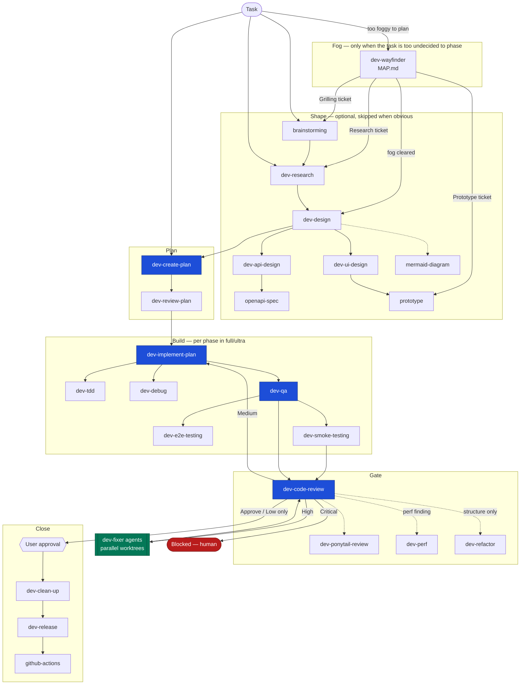
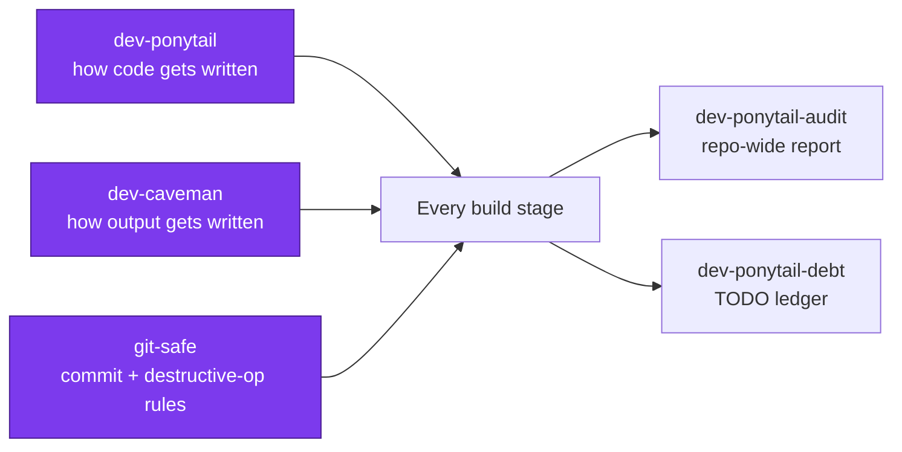
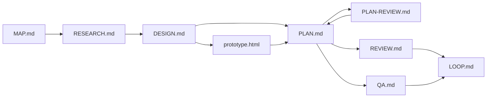

# Skill Map

How the 29 skills and 4 agents fit together. `dev-loop` is the autonomous spine — everything
else is either a stage it calls, an overlay that governs how work is done, or a standalone
entry point that feeds it.

## The autonomous loop

## Overlays — always on, never a stage

`dev-ponytail` (build the smallest thing) and `dev-caveman` (compress the talking) govern *how*
every stage above runs. They produce no artifact and appear nowhere in the flow.

## Agents

| Agent | Spawned by | Owns |
|-------|-----------|------|
| `dev-researcher` | dev-create-plan, dev-implement-plan, dev-loop | one scoped research question → `.spec/<feature>/research/<topic>.md` |
| `dev-implementer` | dev-implement-plan, dev-loop | one PLAN.md phase in its own worktree |
| `dev-fixer` | dev-loop after a failing review | one group of REVIEW.md findings |
| `dev-tester` | dev-qa (ultra), dev-loop | one module's coverage gaps |

Every spawn instruction says "when available, else general-purpose" — the skills work with the
plugin's agents absent.

## Artifacts

All under `.spec/<feature-name>/`, each written by exactly one skill and read by the next:

`LOOP.md` is the resume point: an interrupted loop reconstructs its position from that file
alone.
