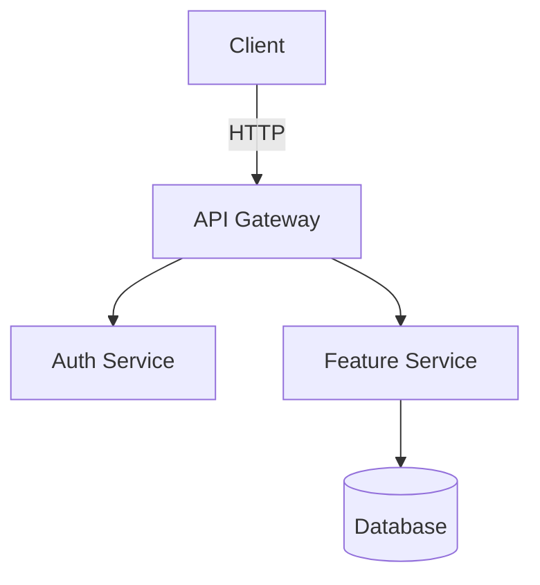

# Create Implementation Plan

## Primary Directive

Create a `docs/<feature-name>/PLAN.md` file that is structured for autonomous execution — by AI agents or humans. The plan uses GitHub-flavored markdown checkboxes so agents can tick tasks as they complete them, and integrates git commits at phase boundaries to create a clean, reviewable history.

## Output Location & Naming

- Always save to `docs/<feature-name>/PLAN.md` where `<feature-name>` is a kebab-case slug of the feature/goal
- Example: `docs/rate-limiting/PLAN.md`, `docs/auth-refactor/PLAN.md`, `docs/postgres-upgrade/PLAN.md`
- Create the directory if it doesn't exist

## Git Integration

The agent executing the plan should:

1. **Before creating the plan file**: commit the plan as its own commit: `git add docs/<feature-name>/PLAN.md && git commit -m "plan: <feature-name>"`
2. **Before each implementation phase**: ensure the working tree is clean so each phase's work is isolated
3. **After completing each phase**: stage changed tracked files and any intentionally created new files explicitly, then commit before moving to the next phase
4. **On plan completion**: the commit history maps 1:1 to the plan phases — each phase is a separate, reviewable commit

**Commit hygiene:**
- Use `git add -u` for modified/deleted tracked files. Stage new files explicitly by path: `git add path/to/new/file`.
- Never use `git add -A` — it stages untracked files (build artifacts, `.env`, generated code) that don't belong in commits.
- Never add a `Co-authored-by:` trailer to commits. The commit author is the human doing the work.
- **Subject line ≤ 72 chars, imperative mood.** Explain *why* the change was made, not what files changed (the diff shows that). A short body (1–3 sentences) is fine for non-obvious motivation; bullet lists of changes are not.

This keeps the plan commit separate from implementation commits, making the history clean and reviewable.

## Status Values

| Status | Badge Color | Meaning |
|--------|-------------|---------|
| `Planned` | blue | Not started |
| `In progress` | yellow | Active work |
| `Completed` | brightgreen | Done |
| `On Hold` | orange | Paused |
| `Deprecated` | red | Abandoned |

Badge URL pattern: `https://img.shields.io/badge/status-<status>-<color>`
For multi-word status, replace spaces with `%20`: `In%20progress`

## Tracker ID Handling

If the user provides a ticket ID or URL, include it everywhere it adds traceability:

| Input form | Where to put it |
|------------|----------------|
| `PROJ-123` (Jira key) | `ticket:` frontmatter + blockquote link under the title badge |
| `LIN-456` (Linear ID) | same |
| Full URL (any tracker) | same — use the URL as the link href |
| No ticket provided | omit the `ticket:` field and the blockquote entirely |

**Detect the tracker from the ID format:**
- `[A-Z]+-\d+` with no URL → Jira. Construct link as `https://<org>.atlassian.net/browse/<ID>`. If org is unknown, use the raw ID without a hyperlink.
- `[A-Z]+-\d+` but user is on Linear → `https://linear.app/team/issue/<ID>`
- Full URL → use as-is

**Also include the ticket ID in the git commit message** for the plan commit:
```
git commit -m "plan: <feature-name> (<ticket-id>)"
```

---

## Planning Principles

**Think before planning**
- Surface assumptions explicitly. If the feature or scope is ambiguous, ask — don't pick an interpretation silently.
- If multiple valid approaches exist, name them and state which the plan takes and why (or capture them in "Alternatives Considered").
- If a simpler solution exists than what was asked for, say so before writing the plan.

**Define verifiable success criteria**
- Every phase must have a completion criterion that can be checked by running a command, reading output, or observing behaviour — not just "it should work".
- Weak criteria ("make it work") cause constant clarification loops during execution. Strong criteria let an agent execute and verify independently.
- Transform vague goals before writing tasks: "add validation" → "invalid inputs return 400 with a descriptive error message (test covers 3 cases)".

## Plan Writing Rules

These rules apply to every plan you generate. Read them before writing a single line.

**For the human reader (6-month test)**
- Write as if the reader has forgotten all context from today's conversation. They should understand the plan without asking you anything.
- Every phase and task must make sense standalone. No "as discussed" or "see above".
- Use plain language. If you need a glossary, the plan is already too complex.

**For the AI agent executor**
- Each task must carry enough context for an agent with no prior session: what file, what function, what exact change, what command.
- Acceptance criteria describe *outcomes*, not steps. Bad: "call the function". Good: "endpoint returns 200 with `{ok: true}`".
- Verify steps must be concrete and runnable — no invented inputs, no "it should work".
- Include error behavior in the task that owns it. Don't leave a separate "error handling" task floating at the end.

**Against verbosity — the most important rule**
- A plan that takes longer to read than to implement is a bad plan.
- Each task: one sentence of what, one sentence of why (if non-obvious). Nothing else.
- No padding. No restating what the code already shows. No "this task ensures that we…".
- If a section has nothing to say, write one short line rather than filler prose.
- Aim for a plan a developer can scan in 2 minutes and act on immediately.

**Splitting vs. merging**
- If a task has more than 3 acceptance criteria, split it into two tasks.
- If two tasks always complete together and share the same verify step, merge them.
- One phase = one coherent goal. If you find yourself writing "and also…", start a new phase.

---

Use GitHub-flavored checkboxes for all tasks so agents can update them inline:

```markdown
- [ ] TASK-001: Description of task
- [x] TASK-002: Completed task
```

Agents MUST update checkboxes to `[x]` as each task is completed — this is the primary progress tracking mechanism.

## Mandatory Template

Every plan file must use this structure. Sections marked **[if applicable]** may be omitted when they add no value — e.g., skip "Alternatives Considered" for a straightforward feature with no real design choices, skip "Architecture Diagram" for a small bug fix or config change. Always include sections 1 and 2; include the rest when they reduce ambiguity or risk.

```markdown
---
goal: <Concise title describing what this plan achieves>
version: 1.0
date_created: <YYYY-MM-DD>
last_updated: <YYYY-MM-DD>
owner: <team or individual>
status: 'Planned'
tags: [feature|upgrade|refactor|chore|architecture|migration|bug]
# ticket: <JIRA-123 | LIN-456 | URL>  ← uncomment and fill in only if a tracker ticket exists
---

# <Plan Title>


<!-- If a tracker ticket exists, add the link here. Otherwise delete this line.
> **Tracker**: [TICKET-123](https://link-to-ticket)
-->

<2-3 sentence introduction: what this plan achieves and why it's being done.>

## 1. Requirements & Constraints

- **REQ-001**: <Functional requirement>
- **SEC-001**: <Security requirement, if applicable>
- **CON-001**: <Constraint that limits implementation choices>
- **GUD-001**: <Guideline or best practice to follow>
- **PAT-001**: <Pattern to apply>

## 2. Implementation Steps

> **Agent instructions**: After completing all tasks in a phase, stage with `git add -u` (plus explicit paths for new files) and commit. No `Co-authored-by:` trailers. Update checkboxes to `[x]` as each task is completed.

### Phase 1: <Phase Name>

**Goal**: <What this phase achieves and why it comes first.>

- [ ] TASK-001: <Exact action with file path, function name, or command. No ambiguity.>
- [ ] TASK-002: <Exact action.>
- [ ] TASK-003: <Exact action.>

**Completion criteria**: <Measurable condition that proves this phase is done, e.g., "all tests pass", "endpoint returns 200", "migration runs without error">

**git commit**: `git add -u && git commit -m "<type>: <phase 1 summary>"` — no `Co-authored-by:` trailer

---

### Phase 2: <Phase Name>

**Goal**: <What this phase achieves.>

**Depends on**: Phase 1 complete

- [ ] TASK-004: <Exact action.>
- [ ] TASK-005: <Exact action.>
- [ ] TASK-006: <Exact action.>

**Completion criteria**: <Measurable condition.>

**git commit**: `git add -u && git commit -m "<type>: <phase 2 summary>"` — no `Co-authored-by:` trailer

---

## 3. Alternatives Considered [if applicable]

> Include when there were real design choices. Skip for straightforward tasks with no meaningful alternatives.

- **ALT-001**: <Alternative approach> — rejected because <reason>

## 4. Dependencies [if applicable]

> Include when external libraries, services, or teams must be in place before work can start.

- **DEP-001**: <Library, service, or component this plan depends on>

## 5. Affected Files [if applicable]

> Include for large or cross-cutting changes where the scope isn't obvious from the phases.

- **FILE-001**: `<path/to/file.ext>` — <what changes and why>

## 6. Testing

- [ ] TEST-001: <Specific test to write or run, with file path>
- [ ] TEST-002: <Integration test or manual verification step>

## 7. Risks & Assumptions [if applicable]

> Include when there are non-obvious risks or unverified assumptions that could derail implementation.

- **RISK-001**: <Risk> — mitigation: <how to reduce it>
- **ASSUMPTION-001**: <Something assumed true that hasn't been verified>

## 8. Architecture Diagram [if applicable]

> Include for new services, significant data-flow changes, or multi-component interactions. Skip for single-file or config-only changes. Use Mermaid for flow/sequence/component diagrams; ASCII for simple layouts.



Common diagram types: `graph TD/LR` (components), `sequenceDiagram` (request/response), `erDiagram` (schema), `flowchart LR` (decisions).

## 9. Related Specs & Further Reading [if applicable]

- <Link or filename of related plan/doc>
```

## Plan Generation Process

When the user asks you to create a plan:

1. **Clarify** (if not obvious): What is the feature/change? What's the scope? Are there known constraints?
2. **Determine `<feature-name>`** for the output path and branch name
3. **Create a feature branch**: `git checkout -b <feature-name>`
4. **Create** `docs/<feature-name>/PLAN.md` using the template above
5. **Commit the plan**: `git add docs/<feature-name>/PLAN.md && git commit -m "plan: <feature-name>"`
6. **Tell the user**: "Plan created at `docs/<feature-name>/PLAN.md` on branch `<feature-name>`. Commit after each phase as you implement."

## Additional Suggestions for Power Users

- **Plan evolution**: If the plan changes mid-execution, update the PLAN.md in its own commit: `git add docs/<feature-name>/PLAN.md && git commit -m "docs: update plan for <feature-name>"` — don't bury plan edits inside implementation commits
- **Parallel tasks**: Tasks within a single phase can be done in parallel. Cross-phase tasks require the prior phase's commit to exist first
- **Stacked review**: Because each phase is a separate git commit, you can push and request review per-phase via PR
- **Progress at a glance**: `grep -E "\- \[.\]" docs/*/PLAN.md` shows all tasks and their completion state across all plans
