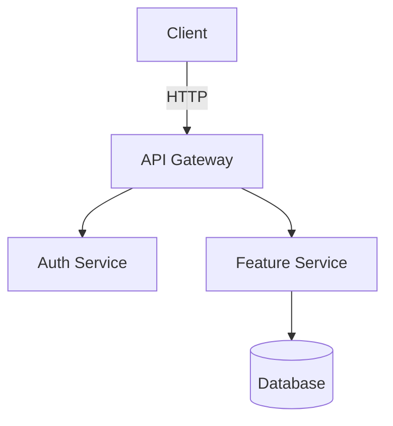

# Create Implementation Plan

## Primary Directive

Create a `docs/<feature-name>/PLAN.md` that is structured for autonomous execution — by AI agents or humans. Checkboxes let agents tick tasks as they complete them. Phase-boundary commits produce a clean, reviewable history.

**Two invocation modes:**

| Mode | When | Behaviour |
|------|------|-----------|
| **Interactive** | User runs `/create-plan` directly | Ask one focused question if scope is truly ambiguous; otherwise proceed |
| **Autonomous** | Called by `dev-loop` | Never ask clarifying questions. Research the codebase, state assumptions explicitly in the plan, proceed |

The caller (user or `dev-loop`) sets the mode implicitly. If there is no conversation context to ask into, you are in autonomous mode.

---

## Step 0 — Research Before Planning

Before writing a single line of the plan, read the codebase:

```bash
git branch --show-current            # confirm or create feature branch
find . -type f -name "*.go" | head -30   # or *.ts, *.py — sense the language
grep -r "func main\|app.listen\|def main" . --include="*.go" -l | head -5
ls docs/ 2>/dev/null                 # look for existing plans
```

Read 3–5 key files to understand:
- How existing features are structured (routing, middleware, error handling)
- What testing patterns are in use
- What conventions the plan must follow

Record your findings as `ASSUMPTION-*` entries in §7 of the plan. Do not ask — assume and document.

---

## Output Location & Naming

- Save to `docs/<feature-name>/PLAN.md` where `<feature-name>` is a kebab-case slug
- Examples: `docs/rate-limit-login/PLAN.md`, `docs/auth-refactor/PLAN.md`
- Create the directory if it doesn't exist

---

## Git Integration

The executing agent must:

1. **Create a feature branch** before writing the plan: `git checkout -b <feature-name>`
2. **Commit the plan file** as its own commit: `git add docs/<feature-name>/PLAN.md && git commit -m "plan: <feature-name>"`
3. **After each phase**: stage with `git add -u` (plus explicit paths for new files) and commit
4. **On plan completion**: commit history maps 1:1 to plan phases

**Commit hygiene:**
- `git add -u` for modified/deleted tracked files. New files by explicit path.
- Never `git add -A` — it stages artifacts and `.env` files.
- No `Co-authored-by:` trailers.
- Subject ≤ 72 chars, imperative mood, explain *why* not what.

---

## Status Values

| Status | Badge Color | Meaning |
|--------|-------------|---------|
| `Planned` | blue | Not started |
| `In progress` | yellow | Active work |
| `Completed` | brightgreen | Done |
| `On Hold` | orange | Paused |
| `Deprecated` | red | Abandoned |

Badge URL: `https://img.shields.io/badge/status-<status>-<color>` (replace spaces with `%20`)

---

## Tracker ID Handling

If the user provides a ticket ID or URL, include it everywhere it adds traceability:

| Input | Where |
|-------|-------|
| `PROJ-123` (Jira) | `ticket:` frontmatter + blockquote link under the badge |
| `LIN-456` (Linear) | same |
| Full URL | same — use as-is |
| None | omit `ticket:` field and blockquote |

**Detect the tracker:**
- `[A-Z]+-\d+` no URL → Jira: `https://<org>.atlassian.net/browse/<ID>` (if org unknown, use raw ID)
- Linear → `https://linear.app/team/issue/<ID>`
- Full URL → use as-is

Include ticket ID in the plan commit: `git commit -m "plan: <feature-name> (<ticket-id>)"`

---

## Planning Principles

**Think before writing**
- Surface assumptions explicitly rather than asking. If scope is ambiguous in interactive mode, ask one focused question only.
- If multiple valid approaches exist, name them and state which the plan takes and why.
- If a simpler solution exists than what was requested, say so in a single sentence in the intro — then plan it.

**Verifiable success criteria**
- Every phase must have a completion criterion runnable by a command or observable behaviour — not "it should work".
- Transform vague goals before writing tasks: "add validation" → "invalid inputs return 400 with a descriptive error message (covered by 3 test cases)".

**Plan writing rules**
- Write as if the reader has forgotten all context. No "as discussed" or "see above".
- Each task: one sentence of what, one sentence of why (if non-obvious). Nothing else.
- No padding. No restating what the code shows. A developer should scan it in 2 minutes and act immediately.
- If a task has more than 3 acceptance criteria, split it. If two tasks always complete together, merge them.
- One phase = one coherent goal. "And also…" → new phase.

---

## Mandatory Template

```markdown
---
goal: <Concise title describing what this plan achieves>
version: 1.0
date_created: <YYYY-MM-DD>
last_updated: <YYYY-MM-DD>
owner: <team or individual>
status: 'Planned'
tags: [feature|upgrade|refactor|chore|architecture|migration|bug]
# ticket: <JIRA-123 | LIN-456 | URL>  ← uncomment only if a ticket exists
---

# <Plan Title>


<!-- If a tracker ticket exists, add the link here. Otherwise delete this line.
> **Tracker**: [TICKET-123](https://link-to-ticket)
-->

<2-3 sentences: what this achieves and why it's being done.>

## 1. Requirements & Constraints

- **REQ-001**: <Functional requirement>
- **SEC-001**: <Security requirement, if applicable>
- **CON-001**: <Constraint that limits implementation choices>
- **GUD-001**: <Guideline or best practice to follow>
- **PAT-001**: <Pattern to apply>

## 2. Implementation Steps

> **Agent instructions**: After completing all tasks in a phase, `git add -u` (plus explicit paths for new files) and commit. No `Co-authored-by:` trailers. Tick checkboxes `[x]` as each task is completed.

### Phase 1: <Phase Name>

**Goal**: <What this phase achieves and why it comes first.>

- [ ] TASK-001: <Exact action with file path, function, or command. No ambiguity.>
- [ ] TASK-002: <Exact action.>
- [ ] TASK-003: <Exact action.>

**Completion criteria**: <Measurable condition — e.g. "all tests pass", "endpoint returns 200", "migration runs without error">

**git commit**: `git add -u && git commit -m "<type>: <phase 1 summary>"` — no `Co-authored-by:` trailer

---

### Phase 2: <Phase Name>

**Goal**: <What this phase achieves.>

**Depends on**: Phase 1 complete

- [ ] TASK-004: <Exact action.>
- [ ] TASK-005: <Exact action.>

**Completion criteria**: <Measurable condition.>

**git commit**: `git add -u && git commit -m "<type>: <phase 2 summary>"` — no `Co-authored-by:` trailer

---

## 3. Alternatives Considered [if applicable]

> Include when there were real design choices. Skip for straightforward tasks.

- **ALT-001**: <Alternative approach> — rejected because <reason>

## 4. Dependencies [if applicable]

> Include when external libraries, services, or teams must be in place first.

- **DEP-001**: <Library, service, or component this plan depends on>

## 5. Affected Files [if applicable]

> Include for large or cross-cutting changes where scope isn't obvious from the phases.

- **FILE-001**: `<path/to/file.ext>` — <what changes and why>

## 6. Testing

- [ ] TEST-001: <Specific test to write or run, with file path>
- [ ] TEST-002: <Integration test or manual verification step>

## 7. Risks & Assumptions

> Always include in autonomous mode. State what was assumed rather than asked.

- **RISK-001**: <Risk> — mitigation: <how to reduce it>
- **ASSUMPTION-001**: <Something assumed true that was not confirmed with the user>

## 8. Architecture Diagram [if applicable]

> Include for new services, data-flow changes, or multi-component interactions. Use Mermaid for flow/sequence; ASCII for simple layouts.



## 9. Related Specs & Further Reading [if applicable]

- <Link or filename of related plan/doc>
```

---

## Plan Generation Process

1. **Research** (§ Step 0) — read the codebase silently
2. **Determine `<feature-name>`** for the output path and branch name
3. **Create feature branch**: `git checkout -b <feature-name>`
4. **Write** `docs/<feature-name>/PLAN.md` using the template above
5. **Commit**: `git add docs/<feature-name>/PLAN.md && git commit -m "plan: <feature-name>"`
6. **Tell the caller**: "Plan created at `docs/<feature-name>/PLAN.md` on branch `<feature-name>`."

In **interactive mode**: if scope is genuinely ambiguous, ask one focused question before step 1. Otherwise skip straight to research.

In **autonomous mode** (called by `dev-loop`): never ask. Proceed directly, document assumptions in §7.

---

## Power User Notes

- **Plan evolution**: if scope changes mid-execution, update PLAN.md in its own commit: `git commit -m "docs: update plan for <feature-name>"` — never bury plan edits inside implementation commits
- **Parallel tasks**: tasks within a phase can run in parallel; cross-phase tasks require the prior phase's commit
- **Progress at a glance**: `grep -E "\- \[.\]" docs/*/PLAN.md` shows all task states across plans
