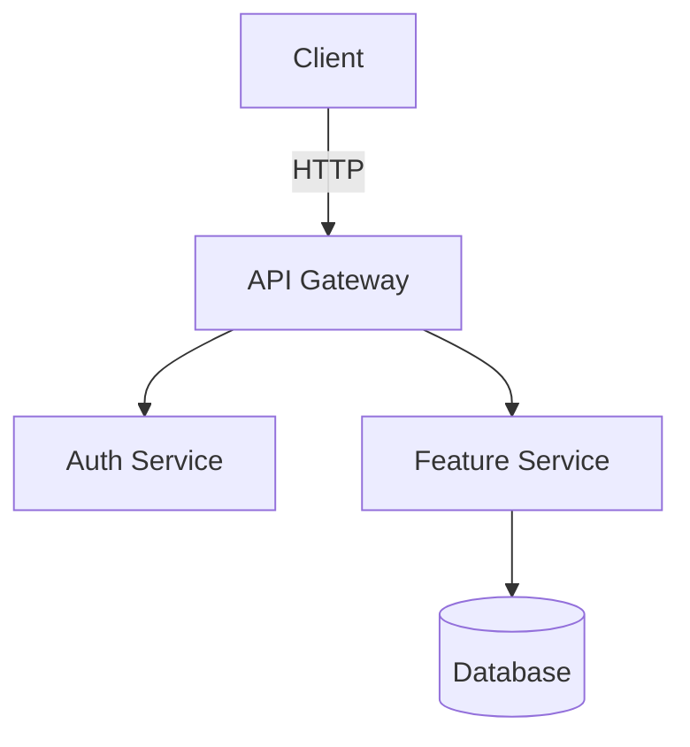

# Create Implementation Plan

## Primary Directive

Create a `docs/<feature-name>/PLAN.md` file that is structured for autonomous execution — by AI agents or humans. The plan uses GitHub-flavored markdown checkboxes so agents can tick tasks as they complete them, and integrates jj commits at phase boundaries to create a clean, reviewable history.

## Output Location & Naming

- Always save to `docs/<feature-name>/PLAN.md` where `<feature-name>` is a kebab-case slug of the feature/goal
- Example: `docs/rate-limiting/PLAN.md`, `docs/auth-refactor/PLAN.md`, `docs/postgres-upgrade/PLAN.md`
- Create the directory if it doesn't exist

## jj Integration

This skill assumes the repo uses Jujutsu (jj). The agent executing the plan should:

1. **Before creating the plan file**: run `jj describe -m "plan: <feature-name>"` to mark the start of work
2. **Before each implementation phase**: run `jj new` to open a fresh commit for that phase's work
3. **After completing each phase**: run `jj describe -m "<type>: <what was done in this phase>"` before moving to the next
4. **On plan completion**: the commit stack maps 1:1 to the plan phases — each phase is a separate, reviewable commit

This keeps the plan commit separate from implementation commits, making the history clean and reviewable.

## Status Values

| Status | Badge Color | Meaning |
|--------|-------------|---------|
| `Planned` | blue | Not started |
| `In progress` | yellow | Active work |
| `Completed` | brightgreen | Done |
| `On Hold` | orange | Paused |
| `Deprecated` | red | Abandoned |

Badge URL pattern: `https://img.shields.io/badge/status-<status>-<color>`
For multi-word status, replace spaces with `%20`: `In%20progress`

## Tracker ID Handling

If the user provides a ticket ID or URL, include it everywhere it adds traceability:

| Input form | Where to put it |
|------------|----------------|
| `PROJ-123` (Jira key) | `ticket:` frontmatter + blockquote link under the title badge |
| `LIN-456` (Linear ID) | same |
| Full URL (any tracker) | same — use the URL as the link href |
| No ticket provided | omit the `ticket:` field and the blockquote entirely |

**Detect the tracker from the ID format:**
- `[A-Z]+-\d+` with no URL → Jira. Construct link as `https://<org>.atlassian.net/browse/<ID>`. If org is unknown, use the raw ID without a hyperlink.
- `[A-Z]+-\d+` but user is on Linear → `https://linear.app/team/issue/<ID>`
- Full URL → use as-is

**Also include the ticket ID in the jj commit message** for the plan commit:
```
jj describe -m "plan: <feature-name> (<ticket-id>)"
```

This makes `jj log` searchable by ticket without opening a browser.

---

## Plan Writing Rules

These rules apply to every plan you generate. Read them before writing a single line.

**For the human reader (6-month test)**
- Write as if the reader has forgotten all context from today's conversation. They should understand the plan without asking you anything.
- Every phase and task must make sense standalone. No "as discussed" or "see above".
- Use plain language. If you need a glossary, the plan is already too complex.

**For the AI agent executor**
- Each task must carry enough context for an agent with no prior session: what file, what function, what exact change, what command.
- Acceptance criteria describe *outcomes*, not steps. Bad: "call the function". Good: "endpoint returns 200 with `{ok: true}`".
- Verify steps must be concrete and runnable — no invented inputs, no "it should work".
- Include error behavior in the task that owns it. Don't leave a separate "error handling" task floating at the end.

**Against verbosity — the most important rule**
- A plan that takes longer to read than to implement is a bad plan.
- Each task: one sentence of what, one sentence of why (if non-obvious). Nothing else.
- No padding. No restating what the code already shows. No "this task ensures that we…".
- If a section has nothing to say, write one short line rather than filler prose.
- Aim for a plan a developer can scan in 2 minutes and act on immediately.

**Splitting vs. merging**
- If a task has more than 3 acceptance criteria, split it into two tasks.
- If two tasks always complete together and share the same verify step, merge them.
- One phase = one coherent goal. If you find yourself writing "and also…", start a new phase.

---


Use GitHub-flavored checkboxes for all tasks so agents can update them inline:

```markdown
- [ ] TASK-001: Description of task
- [x] TASK-002: Completed task
```

Agents MUST update checkboxes to `[x]` as each task is completed — this is the primary progress tracking mechanism.

## Mandatory Template

Every plan file must use exactly this structure. Populate every section; remove nothing.

```markdown
---
goal: <Concise title describing what this plan achieves>
version: 1.0
date_created: <YYYY-MM-DD>
last_updated: <YYYY-MM-DD>
owner: <team or individual>
status: 'Planned'
tags: [feature|upgrade|refactor|chore|architecture|migration|bug]
ticket: <JIRA-123 | LIN-456 | https://app.linear.app/... | https://app.asana.com/...>
---

# <Plan Title>


> **Tracker**: [JIRA-123](https://yourorg.atlassian.net/browse/JIRA-123) <!-- remove if no ticket -->

<2-3 sentence introduction: what this plan achieves and why it's being done.>

## 1. Requirements & Constraints

- **REQ-001**: <Functional requirement>
- **SEC-001**: <Security requirement, if applicable>
- **CON-001**: <Constraint that limits implementation choices>
- **GUD-001**: <Guideline or best practice to follow>
- **PAT-001**: <Pattern to apply>

## 2. Implementation Steps

> **Agent instructions**: Before each phase, run `jj new`. After completing all tasks in a phase, run `jj describe -m "<type>: <phase summary>"`. Update checkboxes to `[x]` as each task is completed.

### Phase 1: <Phase Name>

**Goal**: <What this phase achieves and why it comes first.>

- [ ] TASK-001: <Exact action with file path, function name, or command. No ambiguity.>
- [ ] TASK-002: <Exact action.>
- [ ] TASK-003: <Exact action.>

**Completion criteria**: <Measurable condition that proves this phase is done, e.g., "all tests pass", "endpoint returns 200", "migration runs without error">

**jj commit**: `jj describe -m "<type>: <phase 1 summary>"`

---

### Phase 2: <Phase Name>

**Goal**: <What this phase achieves.>

**Depends on**: Phase 1 complete

- [ ] TASK-004: <Exact action.>
- [ ] TASK-005: <Exact action.>
- [ ] TASK-006: <Exact action.>

**Completion criteria**: <Measurable condition.>

**jj commit**: `jj describe -m "<type>: <phase 2 summary>"`

---

## 3. Alternatives Considered

- **ALT-001**: <Alternative approach> — rejected because <reason>
- **ALT-002**: <Alternative approach> — rejected because <reason>

## 4. Dependencies

- **DEP-001**: <Library, service, or component this plan depends on>
- **DEP-002**: <Another dependency>

## 5. Affected Files

- **FILE-001**: `<path/to/file.ext>` — <what changes and why>
- **FILE-002**: `<path/to/file.ext>` — <what changes and why>

## 6. Testing

- [ ] TEST-001: <Specific test to write or run, with file path>
- [ ] TEST-002: <Integration test or manual verification step>

## 7. Risks & Assumptions

- **RISK-001**: <Risk> — mitigation: <how to reduce it>
- **ASSUMPTION-001**: <Something assumed true that hasn't been verified>

## 8. Architecture Diagram

> Include at least one diagram. Use Mermaid for flow/sequence/component diagrams. Use ASCII the diagram is simple enough.

### Option A — Mermaid

````markdown

````

Common diagram types:
- `graph TD` — component/dependency flow (top-down)
- `graph LR` — left-right flow (better for pipelines)
- `sequenceDiagram` — request/response between services
- `erDiagram` — data model / schema
- `flowchart LR` — decision trees

### Option B — ASCII

```
┌─────────┐     ┌─────────────┐     ┌──────────┐
│ Client  │────▶│ API Gateway │────▶│ Service  │
└─────────┘     └─────────────┘     └────┬─────┘
                                         │
                                    ┌────▼─────┐
                                    │    DB    │
                                    └──────────┘
```

Pick the diagram type that best shows **what changes** in this plan — architecture, data flow, or sequence of calls.

## 9. Related Specs & Further Reading

- <Link or filename of related plan/doc>
- <Link to external docs, RFC, or ADR>
```

## Plan Generation Process

When the user asks you to create a plan:

1. **Clarify** (if not obvious): What is the feature/change? What's the scope? Are there known constraints?
2. **Determine `<feature-name>`** for the output path
3. **Run jj describe** to create the plan commit: `jj describe -m "plan: <feature-name>"`
4. **Create** `docs/<feature-name>/PLAN.md` using the template above
5. **Tell the user**: "Plan created at `docs/<feature-name>/PLAN.md`. Use `jj new` before starting Phase 1, and commit after each phase."

## Agent Execution Checklist

When an agent is executing a plan from this file, it should follow this protocol for each phase:

```
1. jj new                                    # open fresh commit for this phase
2. Read the phase tasks top to bottom
3. Execute each task
4. Update checkbox: - [x] TASK-NNN
5. Verify completion criteria
6. jj describe -m "<type>: <phase summary>"  # seal the phase commit
7. Move to next phase
```

If a task fails or is blocked, add a note inline below the checkbox:
```
- [x] TASK-005: <description>
  > Blocked: <reason>. Resolved by: <what was done instead>.
```

## Additional Suggestions for Power Users

- **Bookmark per plan**: `jj bookmark create <feature-name>` at the start to track the feature branch
- **Plan evolution**: If the plan changes mid-execution, update the PLAN.md in a new `jj new` commit with message `docs: update plan for <feature-name>` — don't rewrite history
- **Parallel tasks**: Tasks within a single phase can be done in parallel. Cross-phase tasks require the prior phase's jj commit to exist first
- **Stacked review**: Because each phase is a separate jj commit, you can push the stack and get each phase reviewed independently via `jj git push`
- **Undo a phase**: If a phase goes wrong, `jj op log` shows every operation. `jj abandon <change-id>` removes a bad phase commit cleanly
- **Progress at a glance**: `grep -E "\- \[.\]" docs/*/PLAN.md` shows all tasks and their completion state across all plans
