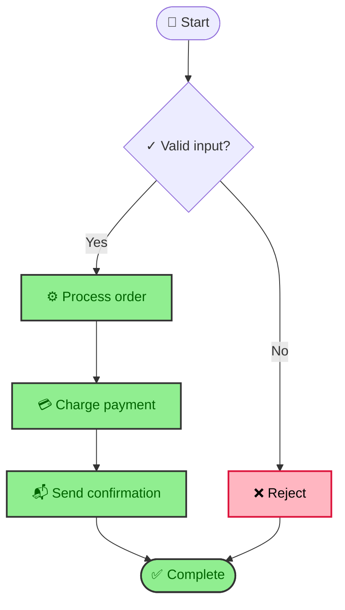
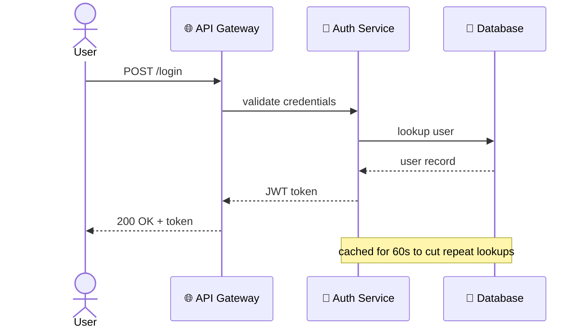
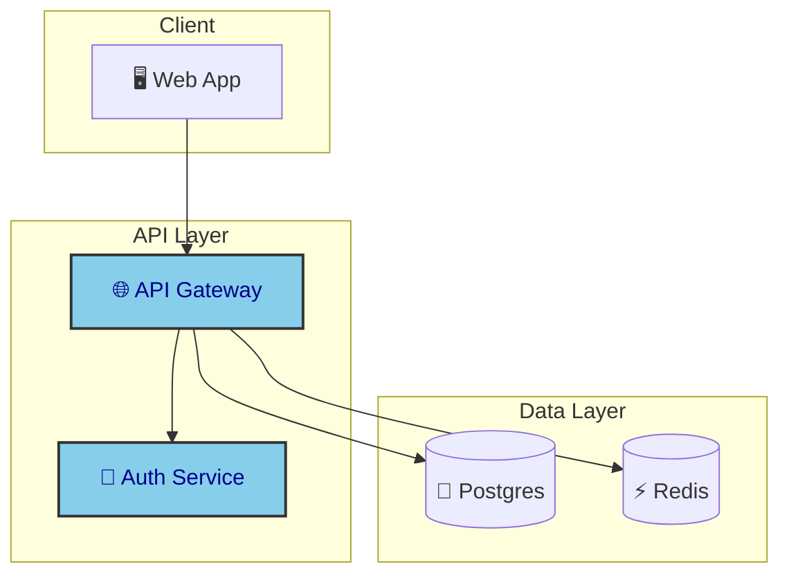
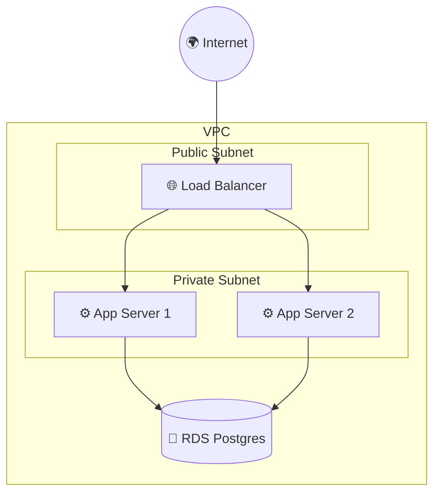
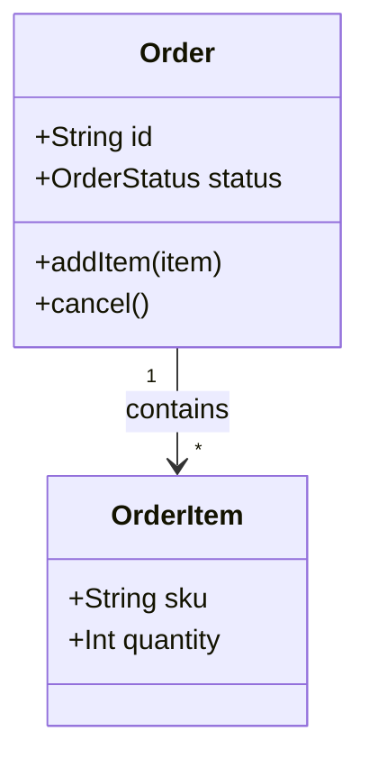
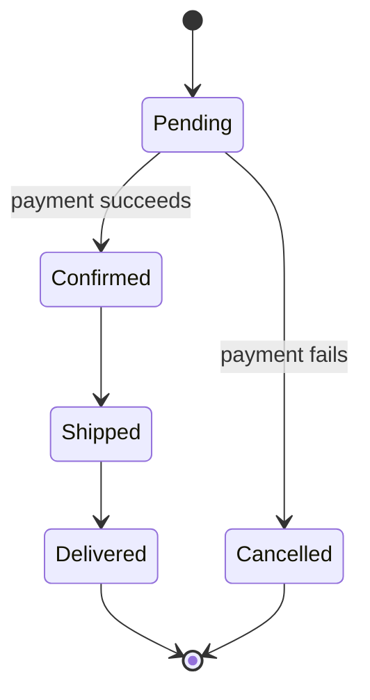
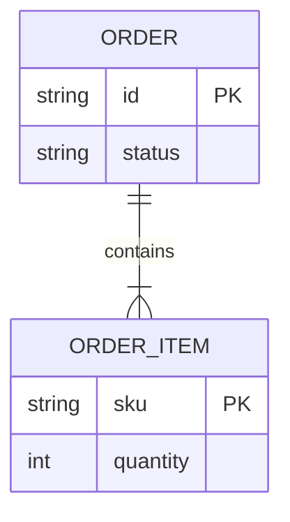

# Mermaid Diagram Templates

Worked examples per diagram type for `mermaid-diagram`, plus the syntax gotchas that account for most render failures. Adapt node names/labels, don't paste unmodified.

## Activity / Flowchart



Use `{}` for decision points, `()` / `([])` for start/end, `[]` for a process step. Keep one flowchart per concept — if it needs a legend to explain two unrelated flows sharing a canvas, split it.

## Sequence



`->>` is a solid arrow (request), `-->>` is dashed (response) — keep that convention consistent so the diagram reads as a call/return pair without needing to read every label.

## Architecture



Group by architectural layer with `subgraph`, not by arbitrary visual proximity — the subgraph boundary should mean something (a deployment unit, a team boundary, a network zone).

## Deployment



Mirror the actual network boundaries (public/private subnet, VPC, availability zone) as nested `subgraph`s — this is the one diagram type where the visual grouping should match infrastructure-as-code reality, not just conceptual grouping.

## Class



## State



## ER



## Syntax Gotchas (why most renders fail)

- **Reserved words as bare node IDs break the parser** — `end`, `class`, `style`, `default`, `subgraph`, `click` used unquoted as an identifier. Quote them: `"end"` not `end`.
- **Arrow syntax must be exact** — `-->` not `->`, `-.->`  for dashed, `==>` for thick. A single missing dash is a silent parse failure, not a warning.
- **Unescaped special characters in labels** (`"`, `(`, `)`, `:`, `#`, `%`) break rendering — wrap the label in quotes: `A["Say \"hello\""]`.
- **Every `subgraph` needs a matching `end`** — a missing `end` cascades into "unexpected token" errors on unrelated later lines, which makes the real cause easy to miss; count subgraphs vs. ends first when a flowchart won't parse.
- **`classDef`/`class` styling only takes effect with `color:` set explicitly** — Mermaid doesn't reliably auto-contrast text against a custom `fill:`.

## Validating and Converting

```bash
# Render to check for syntax errors (also produces the image if needed)
npx -y @mermaid-js/mermaid-cli -i diagram.mmd -o diagram.png -b transparent

# SVG, custom theme
npx -y @mermaid-js/mermaid-cli -i diagram.mmd -o diagram.svg -t dark
```

A non-zero exit means the syntax is broken — read the stderr line number against the diagram source, check it against the gotchas above first before guessing.
